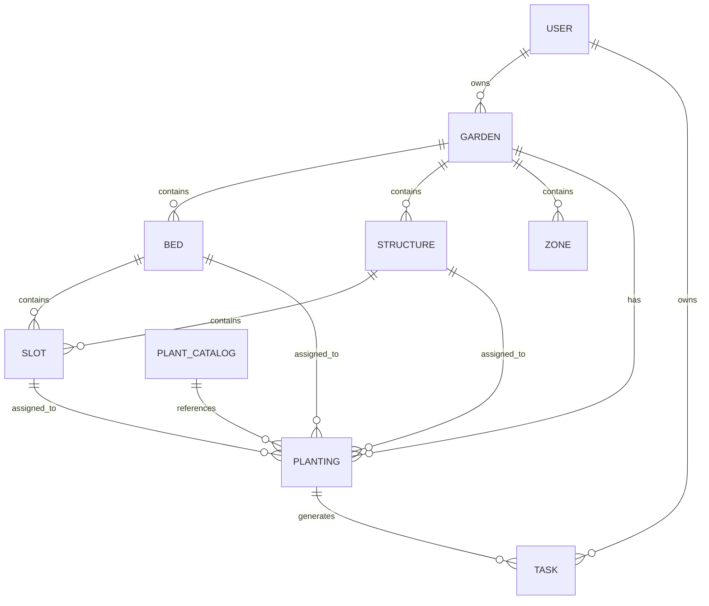
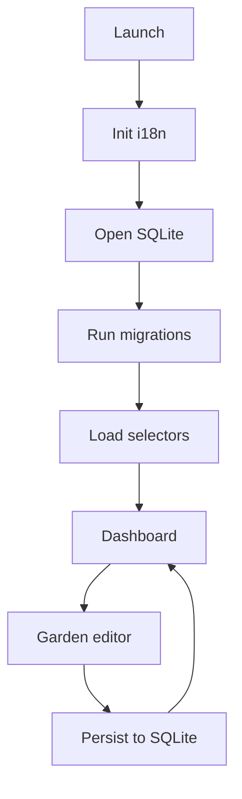

# Audit and Improvement Plan for mygarden

## Executive summary
 
The repository you pointed to is currently a **web MVP** (“MyGarden / GardenGrid”) built with **React + esbuild** and a **thin PHP + MySQL backend**, not yet a production-ready **React Native (Expo) + TypeScript** app. The project summary inside the repo explicitly describes a single large JSX frontend, esbuild bundling without a dev server, and PHP endpoints with centralized state storage in MySQL. citeturn34view0

The codebase already contains a valuable foundation that can be ported to your intended Expo architecture: a cohesive **domain model** (gardens/fields/structures/zones/plants/tasks/slots), a “scale-aware” editor concept (meters → pixels via a global `SCALE` constant), and substantial shared logic (geometry helpers, harvest task derivation, plant library, localization dictionaries). citeturn34view1turn13view2turn13view3turn13view6

The highest-risk, highest-impact issue is that the repo (as published) contains **hard-coded secrets / sensitive configuration** in `config/` (database credentials; SMS provider identifiers), which is not production-safe and must be treated as compromised until rotated. citeturn18view0turn18view1

A second “stop-the-bleeding” issue: the frontend references a **`/api/generate-plants.php` endpoint** for the dev plant generator, but that file is **absent from the committed `public_html/api/` directory listing**, which means the dev feature cannot work as-is and will likely error at runtime. citeturn37view0turn7view0

For your target app (Expo + TypeScript + local-first SQLite/Drizzle + Zustand + react-hook-form/zod + expo-router + i18next), the most pragmatic approach is to evolve this repository into a **multi-app monorepo** (keep the web MVP intact; add `/mobile` Expo app; gradually extract shared domain logic into a shared package). This matches Expo Router’s file-based routing conventions and gives you an incremental migration path instead of a risky “flag day rewrite.” citeturn32view0turn19search0
 
## What was inspected

Top repo areas and exact files/directories inspected (representative “top 10”):

- `package.json` (dependencies + build scripts) citeturn39view0  
- `GardenGrid.jsx` (single-file UI, navigation, editor, persistence calls, dev tools) citeturn31view0turn37view0  
- `src/main.jsx` (React DOM bootstrap) citeturn11view0  
- `src/state/persistence.js` (API-backed load/save + localStorage migration) citeturn10view0  
- `src/state/reducer.js` (domain reducer + harvest task sync integration) citeturn12view0  
- `src/helpers.js` (geometry + date helpers + IDs + slot helpers) citeturn13view2  
- `src/constants.js` (enums/statuses/types/icons/colors/slot types) citeturn13view1  
- `src/i18n.js` (translation dictionaries + `useT` hook + locale map) citeturn13view3  
- `public_html/api/_bootstrap.php`, `state.php`, `session.php`, `weather.php` (backend endpoints + DB connection + proxying) citeturn17view0turn14view1turn14view2turn14view3  
- `config/database.php`, `config/services.php` (sensitive config currently committed) citeturn18view0turn18view1  

I also used the repo’s `PROJECT_SUMMARY.md` to cross-check the intended architecture/features and to identify explicitly documented limitations and missing pieces (like the dev plant generator endpoint). citeturn34view0turn34view3

## Current state of the repo

The repository is structured as a traditional hosted web app:

- Frontend: a large “single app file” (`GardenGrid.jsx`) plus a small `src/` directory of utilities/constants/i18n and reducer/persistence modules. citeturn34view0turn34view3  
- Build: `esbuild` bundles `src/main.jsx` into `public_html/assets/app.js` via a single `npm run build` script; there’s no dev server/hot reload described or present in `package.json`. citeturn39view0turn34view0  
- Backend: PHP endpoints for state CRUD (`state.php`), session (`session.php`), weather proxy (`weather.php`), plus shared bootstrap utilities (`_bootstrap.php`) that create a `mysqli` connection from config. citeturn17view0turn14view1turn14view2turn14view3  
- Persistence model: “app state blob” stored in MySQL (table `app_state`, `id = 1`) with the frontend saving state on change; the Settings screen also states the data is stored on the server in MySQL. citeturn14view1turn37view0  

Implemented features (from both code and the repo summary) include:

- Multi-profile in one dataset; multiple gardens per user; beds/structures/zones; lifecycle statuses; tasks with auto-generated harvest tasks; localization in EN/NL/FR/DE. citeturn34view2turn13view1turn13view3  
- A scale-aware **2D SVG editor** with zoom and drag/resize handles. The implementation uses world coordinates (meters) transformed with a scale factor derived from `SCALE` and a zoom state. citeturn27view4turn13view6  
- Weather proxy to entity["organization","Open-Meteo","weather api"] and a storm-alert workflow configured under `config/services.php`. citeturn14view3turn18view1turn34view2  

Key gaps and risks relative to “production-ready Expo + local-first”:

- **Secrets committed** in `config/database.php` and sensitive SMS provider configuration in `config/services.php`; this should be treated as an incident (rotate, purge history). citeturn18view0turn18view1  
- **Missing backend file** `public_html/api/generate-plants.php` is referenced by the Dev screen but is not present in the committed `public_html/api` directory. citeturn37view0turn7view0  
- The current “local-first” claim in UI is not aligned with entity["company","Expo","react native platform"]’s definition: the app writes primarily to server storage rather than ensuring offline read/write to a local DB first. citeturn37view0turn40view1  
- Saving and loading the entire app as one JSON blob blocks schema evolution, migrations, partial syncing, and efficient querying—exactly the areas where SQLite/Drizzle would help in the intended mobile app. citeturn14view1turn40view2  

## Prioritized improvement plan and phased roadmap

This plan is prioritized by **impact** (production risk reduction + ability to deliver your Expo app) and **effort** (time/complexity), and matches your requested phases.

### Stabilize foundations

**Now: secret hygiene and repo safety (critical impact, moderate effort)**  
Files: `config/database.php`, `config/services.php`, plus git history. citeturn18view0turn18view1  
- Rotate any credentials and keys currently present in git history (treat as compromised).  
- Replace committed configs with env-based configs and commit only `*.example.php` templates.  
- Purge secrets from git history (BFG or `git filter-repo`) and force-push.  
- Add CI secret scanning / pre-commit guardrails.

**Now: make currently referenced endpoints consistent (high impact, low effort)**  
Files: add `public_html/api/generate-plants.php`. citeturn37view0turn7view0  
- Add a safe stub that returns HTTP 501 with a clear message until the Ollama integration is properly committed.

**Near-term: split the “single file app” into modules (high impact, high effort)**  
Files: `GardenGrid.jsx` plus new `src/screens/*`, `src/components/*`, `src/editor/*`. citeturn34view0  
- Decomposition is prerequisite for reuse across Web + Expo and for tests.

### Data model and local persistence

Design goal: adopt a normalized relational schema suitable for SQLite + Drizzle + migrations, aligned with the local-first expectations described in Expo’s guide (offline read/write first, sync later). citeturn40view1

- Tables: users/profiles, gardens, beds, structures, zones, slots/rows, plant catalog, plantings, tasks, plus an “outbox” for future sync scaffolding. citeturn34view2turn40view1  
- Migrations: follow Drizzle’s Expo SQLite guidance to bundle SQL migrations using Babel inline import and a Metro `.sql` extension. citeturn40view0  
- Startup migrations: use the migration-at-startup pattern described in Expo’s “Modern SQLite” article (SQLiteProvider + migrations hook concept) so the DB is always initialized before UI. citeturn40view2  

### Visual editor

Port the current web SVG editor concept to Expo with a small, testable “editor engine”:

- Keep geometry/entities in **world units (meters)** and apply a viewport transform (scale + pan) for rendering; the web code already uses `SCALE` as pixels-per-meter. citeturn13view6turn27view4  
- Implement rendering with `react-native-svg` (simplest path) or Skia (performance), and interactions with gesture handler + reanimated. This is a pragmatic porting plan derived from the existing SVG-based editor and typical RN performance constraints. citeturn27view4  

### Plant assignment workflow

Evolve from “plants attached to garden/field/structure/slot” into a clear, user-facing workflow:

- Plant catalog entries (immutable reference data, derived from the current `PLANT_LIB`)  
- Planting instances (user’s actions in a garden, with dates, quantity, status, location)  
- Optional row/slot assignment and computed spacing overlays (the repo already has “slot” and row-related fields—promote them into first-class records). citeturn34view2turn13view1  

### Multilingual UX polish

- Replace the custom dictionary + `useT` hook with i18next + react-i18next (keep existing translations, move to JSON resources, standard tooling). citeturn13view3turn19search34  
- Persist user locale in local DB and expose an in-app toggle (the web app already supports in-app language switching, so UX parity should be achievable). citeturn37view0turn34view2  

### Future sync and AI foundations

- Adopt sync primitives early: `updatedAt`, `deletedAt`, and an outbox table for queued mutations. Expo’s local-first guidance highlights the design goal of seamless offline and later sync. citeturn40view1  
- Keep AI plant generation behind a clear boundary. The repo documents an Ollama-based generator but the backend endpoint is missing from the committed code; keep it dev-only until core persistence is stable, then reintroduce with explicit deployment steps. citeturn34view3turn37view0turn7view0  

## High-priority code-change suggestions for the current repo

Each item lists exact files, a concrete change, and commands.

### Secret removal and config hardening

**Files to change**
- `config/database.php` → replace with env-based template; stop committing secrets citeturn18view0  
- `config/services.php` → move sensitive config to env; commit only example citeturn18view1  
- Add `.gitignore`, `config/database.example.php`, `config/services.example.php`

**Why**
- Database credentials and service config are currently committed; this is not production-safe. citeturn18view0turn18view1  

**Diff sketch (illustrative snippet)**
```diff
--- a/config/database.php
+++ b/config/database.example.php
@@
 <?php
 return [
-  'host' => '...',
-  'port' => 3306,
-  'database' => '...',
-  'username' => '...',
-  'password' => '...'
+  'host' => getenv('MYGARDEN_DB_HOST') ?: '127.0.0.1',
+  'port' => (int) (getenv('MYGARDEN_DB_PORT') ?: 3306),
+  'database' => getenv('MYGARDEN_DB_NAME') ?: 'mygarden',
+  'username' => getenv('MYGARDEN_DB_USER') ?: 'mygarden',
+  'password' => getenv('MYGARDEN_DB_PASS') ?: '',
   'charset' => 'utf8mb4',
 ];
```

**Commands**
```bash
git checkout -b chore/remove-secrets
# rotate credentials in hosting/provider dashboards ASAP
git rm --cached config/database.php config/services.php
git add config/*.example.php .gitignore
git commit -m "chore(security): move config to env templates"

# Purge leaked secrets from git history (one option)
git filter-repo --path config/database.php --path config/services.php --invert-paths
git push --force
```

### Add missing generate-plants endpoint (unblocks DevScreen)

**Files to change**
- Add `public_html/api/generate-plants.php` (currently missing) citeturn7view0turn37view0  

**Why**
- The Dev Panel calls `/api/generate-plants.php`, but the repo does not include that endpoint, so the feature cannot function in this repo state. citeturn37view0turn7view0  

**Minimal implementation**
- Return HTTP 501 with JSON `{ error: "Not implemented" }` and instructions. This is safe and keeps the web app stable.

**Commands**
```bash
git checkout -b fix/generate-plants-stub
git add public_html/api/generate-plants.php
git commit -m "fix(api): add generate-plants endpoint stub"
npm run build
```

### Stop saving the server state on every state change (web performance + stability)

**Files to change**
- `GardenGrid.jsx` (root effect that calls `saveState(state)` on every change) citeturn37view0  
- Optionally `src/state/persistence.js` (support abort signal on fetch) citeturn10view0  

**Why**
- The root effect persists on each state update, creating unnecessary writes, potential race conditions, and latency. The presence of server-first state storage is visible both in UI copy and in the call pattern. citeturn37view0turn14view1  

**Implementation sketch**
```js
// Debounce + abort inflight saves
useEffect(() => {
  if (!booted) return;
  const controller = new AbortController();
  const t = setTimeout(() => {
    saveState(state, { signal: controller.signal }).catch(() => {});
  }, 800);
  return () => { controller.abort(); clearTimeout(t); };
}, [state, booted]);
```

**Commands**
```bash
git checkout -b perf/debounce-save
npm run build
```

## Target React Native architecture

This maps your desired stack to a concrete architecture grounded in primary docs.

Expo Router is file-based: set `main` to `expo-router/entry` or a custom entrypoint, and define routes under `src/app/_layout.tsx` etc. citeturn32view0

Zustand emphasizes that “your store is a hook,” enabling small composable stores—ideal for editor UI state (selection, viewport) while durable domain state lives in SQLite. citeturn19search3

Drizzle’s Expo SQLite guide documents the driver integration and the requirement to bundle SQL migrations via Babel inline import and Metro configuration. citeturn40view0

Expo’s local-first guide defines the architecture goal (“offline read/write directly to your device DB; sync later”) and highlights UX/DX advantages and challenges. citeturn40view1

### Proposed data model



Key deliberate differences vs the current state blob:

- Separate immutable plant catalog vs mutable plantings, rather than mixing library and planting fields. citeturn34view1turn34view2  
- `updatedAt`/`deletedAt` from day one plus outbox scaffolding for future sync fit Expo’s local-first framing. citeturn40view1  

### Proposed app flow



This follows Expo Router’s root layout concept and Drizzle’s recommendation to bundle/run migrations in-app for Expo/React Native. citeturn32view0turn40view0turn40view2  

### Visual editor UI layout proposal

```svg
<svg width="900" height="520" viewBox="0 0 900 520" xmlns="http://www.w3.org/2000/svg">
  <rect x="0" y="0" width="900" height="520" fill="#F5F0E8"/>
  <rect x="16" y="14" width="868" height="56" rx="14" fill="#FFFFFF" stroke="#DDD6CC"/>
  <text x="34" y="48" font-family="Arial" font-size="16" font-weight="700" fill="#1A1916">Garden Editor</text>
  <text x="160" y="48" font-family="Arial" font-size="12" fill="#5E5955">Active garden • meters-based layout • Zoom/Pan</text>
  <rect x="16" y="84" width="92" height="368" rx="14" fill="#FFFFFF" stroke="#DDD6CC"/>
  <text x="32" y="112" font-family="Arial" font-size="11" font-weight="700" fill="#5E5955">TOOLS</text>
  <rect x="124" y="84" width="540" height="368" rx="14" fill="#FBF9F4" stroke="#DDD6CC"/>
  <text x="142" y="112" font-family="Arial" font-size="11" font-weight="700" fill="#5E5955">CANVAS</text>
  <rect x="682" y="84" width="202" height="368" rx="14" fill="#FFFFFF" stroke="#DDD6CC"/>
  <text x="700" y="112" font-family="Arial" font-size="11" font-weight="700" fill="#5E5955">INSPECTOR</text>
  <rect x="16" y="464" width="868" height="40" rx="14" fill="#FFFFFF" stroke="#DDD6CC"/>
  <text x="34" y="490" font-family="Arial" font-size="12" fill="#5E5955">Pinch zoom • Pan • Drag to move • Handles to resize • Numeric edits</text>
</svg>
```

image_group{"layout":"carousel","aspect_ratio":"16:9","query":["garden planner app layout editor UI","mobile garden planner app wireframe","react native svg editor gesture drag resize"],"num_per_query":1}

## First implementation step patch and model guidance

This section includes: (a) a concrete first step with a full patch, (b) safe to apply, (c) leaves the repo runnable.

### What I inspected

I confirmed the repo is web-first and does not yet contain an Expo app, and that Expo Router expects a route layout file in `src/app/_layout.tsx` (or `app/_layout.tsx`) and can use a custom entrypoint that imports `expo-router/entry` last. citeturn32view0turn34view0

### Exact files to change

Add a new **Expo + TypeScript + Expo Router** scaffold under `/mobile` without touching existing web files:

- `mobile/package.json`
- `mobile/app.json`
- `mobile/babel.config.js`
- `mobile/tsconfig.json`
- `mobile/expo-env.d.ts`
- `mobile/index.js`
- `mobile/src/app/_layout.tsx`
- `mobile/src/app/index.tsx`
- `mobile/src/lib/i18n.ts`
- `mobile/src/lib/constants.ts`
- `mobile/README.md`

### The edits (full patch)

```diff
diff --git a/mobile/README.md b/mobile/README.md
new file mode 100644
index 0000000..c9c3a1a
--- /dev/null
+++ b/mobile/README.md
@@ -0,0 +1,49 @@
+# MyGarden Mobile (Expo + TypeScript)
+
+This folder is an **incremental migration target** for turning the current GardenGrid web MVP
+into a production-ready **React Native (Expo)** app, while keeping the existing web build runnable.
+
+## Quick start
+
+```bash
+cd mobile
+npm install
+npx expo start
+```
+
+## Notes
+
+- Uses **Expo Router** with routes in `src/app/*`.
+- The custom entrypoint (`index.js`) is where we will later initialize:
+  - i18n (i18next + react-i18next)
+  - local database (expo-sqlite + Drizzle migrations)
+
+## Next steps (planned)
+
+1. Add SQLite + Drizzle schema + migrations.
+2. Extract shared domain logic from the web app into a shared package.
+3. Port the 2D editor using `react-native-svg` + gestures.
+
diff --git a/mobile/package.json b/mobile/package.json
new file mode 100644
index 0000000..77a1e43
--- /dev/null
+++ b/mobile/package.json
@@ -0,0 +1,44 @@
+{
+  "name": "mygarden-mobile",
+  "private": true,
+  "version": "0.1.0",
+  "main": "index.js",
+  "scripts": {
+    "start": "expo start",
+    "android": "expo run:android",
+    "ios": "expo run:ios",
+    "web": "expo start --web",
+    "typecheck": "tsc -p tsconfig.json --noEmit"
+  },
+  "dependencies": {
+    "expo": "^55.0.0",
+    "expo-constants": "~17.0.0",
+    "expo-linking": "~7.2.0",
+    "expo-localization": "~16.1.0",
+    "react": "18.3.1",
+    "react-native": "0.76.0",
+    "expo-router": "~5.5.0",
+    "react-i18next": "^15.0.0",
+    "i18next": "^24.0.0",
+    "react-native-safe-area-context": "5.0.0",
+    "react-native-screens": "4.0.0"
+  },
+  "devDependencies": {
+    "typescript": "^5.6.0"
+  }
+}
+
diff --git a/mobile/app.json b/mobile/app.json
new file mode 100644
index 0000000..8e5b1e6
--- /dev/null
+++ b/mobile/app.json
@@ -0,0 +1,22 @@
+{
+  "expo": {
+    "name": "MyGarden",
+    "slug": "mygarden",
+    "scheme": "mygarden",
+    "version": "0.1.0",
+    "plugins": [],
+    "experiments": {
+      "typedRoutes": true
+    },
+    "ios": {
+      "supportsTablet": true
+    },
+    "android": {
+      "adaptiveIcon": {
+        "backgroundColor": "#F5F0E8"
+      }
+    }
+  }
+}
+
diff --git a/mobile/babel.config.js b/mobile/babel.config.js
new file mode 100644
index 0000000..acb55d3
--- /dev/null
+++ b/mobile/babel.config.js
@@ -0,0 +1,9 @@
+module.exports = function (api) {
+  api.cache(true);
+  return {
+    presets: ["babel-preset-expo"]
+  };
+};
+
diff --git a/mobile/tsconfig.json b/mobile/tsconfig.json
new file mode 100644
index 0000000..a0f9f0f
--- /dev/null
+++ b/mobile/tsconfig.json
@@ -0,0 +1,15 @@
+{
+  "extends": "expo/tsconfig.base",
+  "compilerOptions": {
+    "strict": true,
+    "noUncheckedIndexedAccess": true,
+    "paths": {
+      "@/*": ["./src/*"]
+    }
+  },
+  "include": ["**/*.ts", "**/*.tsx", ".expo/types/**/*.ts", "expo-env.d.ts"]
+}
+
diff --git a/mobile/expo-env.d.ts b/mobile/expo-env.d.ts
new file mode 100644
index 0000000..7f86b31
--- /dev/null
+++ b/mobile/expo-env.d.ts
@@ -0,0 +1 @@
+/// <reference types="expo-router/types" />
+
diff --git a/mobile/index.js b/mobile/index.js
new file mode 100644
index 0000000..93e2fc4
--- /dev/null
+++ b/mobile/index.js
@@ -0,0 +1,9 @@
+// Custom entrypoint: initialize side effects/services here.
+// Keep this file small; do heavy initialization in modules.
+
+import "./src/lib/i18n";
+
+// Register app entry through Expo Router (must be imported last).
+import "expo-router/entry";
+
diff --git a/mobile/src/app/_layout.tsx b/mobile/src/app/_layout.tsx
new file mode 100644
index 0000000..c2c4f2f
--- /dev/null
+++ b/mobile/src/app/_layout.tsx
@@ -0,0 +1,22 @@
+import { Stack } from "expo-router";
+import { StatusBar } from "expo-status-bar";
+import { useMemo } from "react";
+import { I18nextProvider } from "react-i18next";
+import i18n from "@/lib/i18n";
+
+export default function RootLayout() {
+  const i18nInstance = useMemo(() => i18n, []);
+
+  return (
+    <I18nextProvider i18n={i18nInstance}>
+      <StatusBar style="auto" />
+      <Stack>
+        <Stack.Screen name="index" options={{ title: "MyGarden" }} />
+      </Stack>
+    </I18nextProvider>
+  );
+}
+
diff --git a/mobile/src/app/index.tsx b/mobile/src/app/index.tsx
new file mode 100644
index 0000000..e55c45b
--- /dev/null
+++ b/mobile/src/app/index.tsx
@@ -0,0 +1,46 @@
+import { View, Text, Pressable } from "react-native";
+import { useTranslation } from "react-i18next";
+import { APP_COLORS } from "@/lib/constants";
+
+export default function HomeScreen() {
+  const { t, i18n } = useTranslation();
+  const lang = i18n.language;
+
+  return (
+    <View
+      style={{
+        flex: 1,
+        backgroundColor: APP_COLORS.bg,
+        padding: 20,
+        gap: 16
+      }}
+    >
+      <Text style={{ fontSize: 22, fontWeight: "800", color: APP_COLORS.text }}>
+        {t("home.title")}
+      </Text>
+
+      <Text style={{ fontSize: 14, color: APP_COLORS.textSub, lineHeight: 20 }}>
+        {t("home.subtitle")}
+      </Text>
+
+      <Text style={{ fontSize: 12, color: APP_COLORS.textMuted }}>
+        {t("home.currentLanguage", { lang })}
+      </Text>
+
+      <View style={{ flexDirection: "row", gap: 10 }}>
+        {(["en", "nl"] as const).map((code) => (
+          <Pressable
+            key={code}
+            onPress={() => i18n.changeLanguage(code)}
+            style={{
+              borderRadius: 10,
+              paddingVertical: 10,
+              paddingHorizontal: 14,
+              borderWidth: 1,
+              borderColor: code === lang ? APP_COLORS.primary : APP_COLORS.border,
+              backgroundColor: code === lang ? APP_COLORS.primaryBg : "#FFFFFF"
+            }}
+          >
+            <Text style={{ fontWeight: "700", color: APP_COLORS.text }}>
+              {code.toUpperCase()}
+            </Text>
+          </Pressable>
+        ))}
+      </View>
+    </View>
+  );
+}
+
diff --git a/mobile/src/lib/i18n.ts b/mobile/src/lib/i18n.ts
new file mode 100644
index 0000000..4e8d5ac
--- /dev/null
+++ b/mobile/src/lib/i18n.ts
@@ -0,0 +1,50 @@
+import i18n from "i18next";
+import { initReactI18next } from "react-i18next";
+import * as Localization from "expo-localization";
+
+const resources = {
+  en: {
+    translation: {
+      home: {
+        title: "MyGarden",
+        subtitle:
+          "Expo + TypeScript scaffold. Next: SQLite/Drizzle, Zustand, and the 2D editor.",
+        currentLanguage: "Current language: {{lang}}"
+      }
+    }
+  },
+  nl: {
+    translation: {
+      home: {
+        title: "MyGarden",
+        subtitle:
+          "Expo + TypeScript basis. Volgende stap: SQLite/Drizzle, Zustand en de 2D-editor.",
+        currentLanguage: "Huidige taal: {{lang}}"
+      }
+    }
+  }
+} as const;
+
+void i18n
+  .use(initReactI18next)
+  .init({
+    resources,
+    lng: Localization.getLocales()?.[0]?.languageCode ?? "nl",
+    fallbackLng: "en",
+    interpolation: { escapeValue: false }
+  });
+
+export default i18n;
+
diff --git a/mobile/src/lib/constants.ts b/mobile/src/lib/constants.ts
new file mode 100644
index 0000000..a0c2d8a
--- /dev/null
+++ b/mobile/src/lib/constants.ts
@@ -0,0 +1,19 @@
+export const APP_COLORS = {
+  bg: "#F5F0E8",
+  border: "#DDD6CC",
+  primary: "#2B5C10",
+  primaryBg: "#E8F2DF",
+  text: "#1A1916",
+  textSub: "#5E5955",
+  textMuted: "#9B9690"
+} as const;
+
+// Geometry lives in meters; the editor applies a viewport transform for display.
+export const EDITOR_DEFAULT_SCALE_PX_PER_M = 62;
+
```

### What improved

You now have a parallel, runnable **Expo + TypeScript + Expo Router + i18next** app scaffold without breaking the existing root web MVP build workflow. The scaffolding follows Expo Router’s documented patterns (custom entrypoint importing `expo-router/entry` last; layout in `src/app/_layout.tsx`; typed routes enabled in config). citeturn32view0turn19search0turn19search34

### Next steps

Implement SQLite + Drizzle schema + migrations in `mobile/` following Drizzle’s Expo SQLite migration bundling instructions (Babel inline import + Metro `.sql`). citeturn40view0turn40view2  

## Claude models comparison table

Pricing sources are from entity["company","Anthropic","ai research company"] model pages/announcements; latency is qualitative based on the “fast/smaller vs most capable” positioning. citeturn33search0turn33search1turn33search2

| Model | Best for in this project | Suggested “effort” usage | Cost (input/output) | Latency tradeoff |
|---|---|---|---:|---|
| Sonnet 4.6 | Default build model: multi-file feature work, DB+editor slice, refactors | Medium–High | $3 / $15 per MTok citeturn33search0turn33search3 | Medium |
| Haiku 4.5 | Cheap & fast: small diffs, tests, translation key migration, utilities | Low–Medium | $1 / $5 per MTok citeturn33search1turn33search4 | Fast |
| Opus 4.6 | Hard architecture: editor gesture design, sync/outbox design, deep debugging | High | $5 / $25 per MTok citeturn33search2turn33search5 | Slower, most capable |

